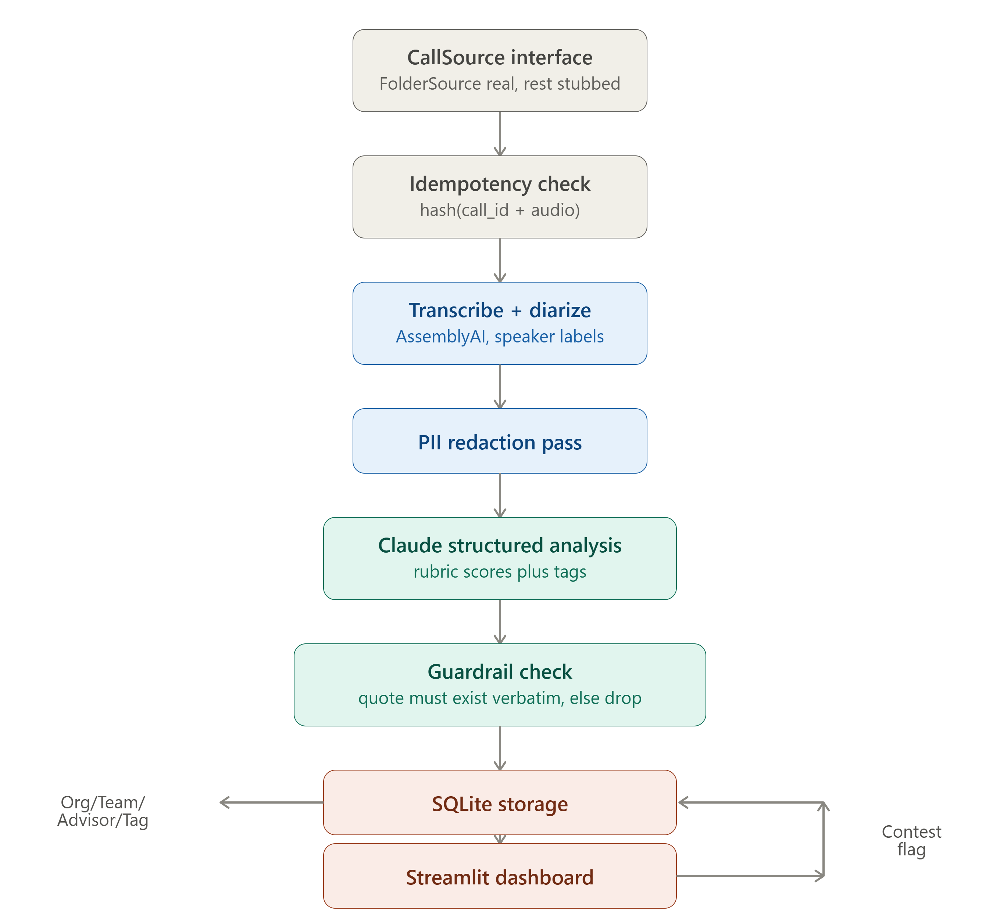
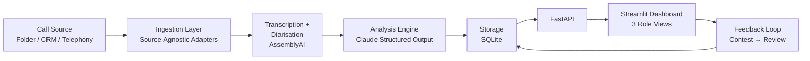

# FitNova Call Intelligence System

Automated sales-call intelligence for FitNova. Transcribes, diarises, scores, and flags issues in advisor calls — surfaced via role-based dashboards with a human-in-the-loop feedback mechanism.

## Quick Start — One-Command Demo

```bash
# 1. Install
pip install -r requirements.txt

# 2. Seed DB & process sample calls
python scripts/run_demo.py

# 3. Start API
uvicorn fitnova.api.main:app --reload

# 4. Start dashboard (new terminal)
streamlit run fitnova/dashboard/app.py
```

## Pipeline Architecture:



## Architecture



### Pipeline Stages

1. **Ingestion** (`fitnova/ingestion/`) — Source-agnostic via `CallSource` abstract base. `FolderSource` reads `data/incoming/`. CRM and Telephony stubs exist with docstrings describing real integration. Adapter pattern means switching telephony vendors requires zero pipeline changes.

2. **Transcription + Diarisation** (`fitnova/pipeline/transcribe.py`) — AssemblyAI with `speaker_labels=True`. Maps labels A/B to "advisor"/"customer" using first-speaker heuristic. Poor diarisation fallback: all speakers → "unknown", flagged on the Call row.

3. **Analysis Engine** (`fitnova/analysis/tagger.py`) — Claude with **tool-use structured output**. Closed set of 7 allowed tags, 5 scoring dimensions (1-5). Anti-hallucination guardrail: every tag's `quoted_line` must appear verbatim in transcript — dropped otherwise.

4. **Storage** (`fitnova/storage/`) — SQLite with SQLAlchemy. Org → Team → Advisor → Call → (Segments, Scores, Tags, Contests). Idempotent via `audio_hash` (SHA-256).

5. **Surfacing** (`fitnova/dashboard/app.py`) — Streamlit: Sales Director (org-wide), Team Leader (drill-down + contest review), Advisor (own calls + contest).

6. **Feedback** — Advisors contest flags → Team Leader upholds/dismisses. Creates audit trail.

## Scoring Rubric

| Dimension | 1-5 Scale |
|-----------|-----------|
| Needs Discovery | Did advisor ask about goals/budget/constraints before pitching? |
| Product Knowledge | Accurate, specific program/pricing/policy knowledge |
| Objection Handling | Addressed concerns without overpromising |
| Compliance | No false claims, no pressure tactics, proper consent |
| Next-Step Booking | Specific trial session booked with time/logistics |

Overall score = average of all 5 dimensions.

## Issue Tag Taxonomy

| Tag | Default Severity | Description |
|-----|-----------------|-------------|
| `no_needs_discovery` | high | Pitched without understanding goals |
| `over_promising` | high | "Guaranteed results", unrealistic promises |
| `pressure_tactics` | high | Limited-time offers, false urgency |
| `price_before_value` | medium | Discount/pricing before value established |
| `undisclosed_costs` | high | Hidden fees mentioned late |
| `weak_trial_booking` | medium | No specific trial booked |
| `talking_over_customer` | low | Interrupting or dominating conversation |

## Anti-Hallucination Guardrail

Every tag from Claude includes a `quoted_line` field. After receiving the response, the system runs a verification pass: if the quoted text does not appear verbatim in the transcript, the tag is **dropped and logged**. This prevents the model from inventing flags.

In the stub analysis (no API key), a simple rule-based scanner does the same: it only creates tags from segments whose text actually contains trigger keywords, and even those pass through the verbatim-quote check.

## Edge Cases Handled

| Case | Handling |
|------|----------|
| **Poor diarisation** | Mono/low-quality audio → all segments tagged "unknown", `diarization_quality="failed"` on Call row |
| **Non-sales calls** | `is_sales_call` classification → scoring/tagging skipped, status = `non_sales_call` |
| **Hallucinated tags** | Verbatim-quote verification drops non-matching tags |
| **Duplicate processing** | SHA-256 audio hash + unique constraint → idempotent |
| **API failures** | Retry support in orchestrator (catches exceptions, sets status="failed" with error log, re-raises) |
| **PII** | Regex-based redaction placeholder (noted as known limitation) |

## What's Real vs Mocked

| Component | Status | Notes |
|-----------|--------|-------|
| Folder ingestion | Real | Reads `data/incoming/` pairs |
| CRM/Telephony sources | Stub | Interface defined, raises NotImplementedError with docstring |
| Transcription (AssemblyAI) | Real when API key set | Falls back to script-parsing stub |
| Analysis (Claude) | Real when API key set | Falls back to rule-based stub |
| Anti-hallucination guardrail | Real | Verbatim-quote verification in both modes |
| Storage / DB | Real | SQLite + SQLAlchemy |
| FastAPI | Real | Full REST surface |
| Dashboard | Real | Streamlit, 3 role views |
| Contest workflow | Real | Creates Contest row, updates Tag status |

## What I'd Build Next

- **Async queue** (Celery + Redis) instead of synchronous processing for scale
- **Code-switching support** for Hindi-English (Whisper already handles it; extend scoring prompts with Hinglish examples)
- **NER-based PII redaction** instead of regex
- **Real CRM adapter** (HubSpot/Salesforce OAuth2 with cursor-based pagination)
- **Voice-print speaker ID** instead of first-speaker heuristic
- **Push notifications** to Team Leaders when high-severity flags go uncontested
