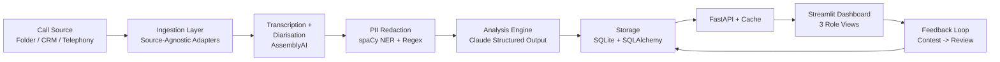

# FitNova Call Intelligence System

Automated sales-call intelligence for FitNova. Transcribes, diarises, scores, and flags issues in advisor calls — surfaced via role-based dashboards with a human-in-the-loop feedback mechanism.

**Live Demo:** [fitnova-dashboard.onrender.com](https://fitnova-dashboard.onrender.com/) — Login: `director@fitnova.in` / `admin123`

**Video Walkthrough:** [▶ Watch Demo](https://www.loom.com/share/36ebe3029df145c597a80071058e76a0)

---

## Quick Start — One-Command Demo

```bash
# 1. Install dependencies
pip install -r fitnova-call-intel/requirements.txt

# 2. Seed DB & process sample calls
python fitnova-call-intel/scripts/run_demo.py

# 3. Start API (Terminal 1)
uvicorn fitnova.call-intel.fitnova.api.main:app --reload

# 4. Start dashboard (Terminal 2)
streamlit run fitnova-call-intel/fitnova/dashboard/app.py
```

**Demo logins**: `director@fitnova.in` / `admin123` — sees org-wide scores and all teams.

---

## Pipeline Architecture:


## System Architecture



### Pipeline Stages

1. **Ingestion** (`fitnova/ingestion/`) — Source-agnostic via `CallSource` abstract base. `FolderSource` reads `data/incoming/` as `.mp3/.wav` + `.json` metadata pairs. CRM and Telephony stubs exist with docstrings describing real integration. Switching telephony vendors = write a new class with 2 methods.

2. **Transcription + Diarisation** (`fitnova/pipeline/transcribe.py`) — AssemblyAI with `speaker_labels=True`, language auto-detection (handles English and Hinglish). Maps labels A/B to "advisor"/"customer" using first-speaker heuristic. Poor diarisation fallback: mono audio -> all segments "unknown", flagged on Call row.

3. **PII Redaction** (`fitnova/analysis/redactor.py`) — Two-layer approach: (a) spaCy NER (PERSON, GPE, ORG, EMAIL, PHONE, MONEY, etc.) + (b) regex patterns for Indian identifiers (Aadhaar, PAN, phone, email, pin-code). Also leverages AssemblyAI's built-in server-side PII redaction (person_name, phone, email, location, banking, credit_card). Excluded words list prevents false positives on domain terms.

4. **Analysis Engine** (`fitnova/analysis/tagger.py`) — Claude with tool-use structured output. Closed set of 7 allowed tags, 5 scoring dimensions (1-5). Anti-hallucination guardrail: every tag's `quoted_line` must appear verbatim in transcript — dropped otherwise.

5. **Storage** (`fitnova/storage/`) — SQLite with SQLAlchemy. Org -> Team -> Advisor -> Call -> (Segments, Scores, Tags, Contests). Idempotent via `audio_hash` (SHA-256).

6. **Surfacing** (`fitnova/dashboard/app.py`) — Streamlit: Sales Director (org-wide), Team Leader (drill-down + contest review), Advisor (own calls + contest).

7. **Feedback** — Advisors contest flags -> Team Leader upholds/dismisses. Creates audit trail.

---

## Scoring Rubric

| Dimension | 1-5 Scale |
|-----------|-----------|
| Needs Discovery | Did advisor ask about goals/budget/constraints before pitching? |
| Product Knowledge | Accurate, specific program/pricing/policy knowledge |
| Objection Handling | Addressed concerns without overpromising |
| Compliance | No false claims, no pressure tactics, proper consent |
| Next-Step Booking | Specific trial session booked with time/logistics |

Overall score = average of all 5 dimensions.

## Issue Tag Taxonomy

| Tag | Default Severity | Description |
|-----|-----------------|-------------|
| `no_needs_discovery` | high | Pitched without understanding goals |
| `over_promising` | high | "Guaranteed results", unrealistic promises |
| `pressure_tactics` | high | Limited-time offers, false urgency |
| `price_before_value` | medium | Discount/pricing before value established |
| `undisclosed_costs` | high | Hidden fees mentioned late |
| `weak_trial_booking` | medium | No specific trial booked |
| `talking_over_customer` | low | Interrupting or dominating conversation |

---

## Edge Cases Handled

| Case | Handling |
|------|----------|
| **Poor diarisation** | Mono/low-quality audio -> all segments tagged "unknown", `diarization_quality="failed"` on Call row |
| **Non-sales calls** | `is_sales_call` classification -> scoring/tagging skipped, status = `non_sales_call` |
| **Code-switching (Hinglish)** | AssemblyAI language auto-detection; prompts mention Hinglish; demo includes Hinglish sample call |
| **PII (redaction)** | Two-layer NER + regex redaction on transcripts and analysis output; AssemblyAI server-side redaction at ingestion |
| **Hallucinated tags** | Verbatim-quote verification drops non-matching tags |
| **Duplicate processing** | SHA-256 audio hash + unique constraint -> idempotent |
| **API failures** | Retry support in orchestrator (catches exceptions, sets status="failed" with error log, re-raises) |

---

## What's Real vs Mocked

| Component | Status | Notes |
|-----------|--------|-------|
| Folder ingestion | Real | Reads `data/incoming/` pairs |
| CRM/Telephony sources | Stub | Interface defined, raises NotImplementedError with docstring |
| Transcription (AssemblyAI) | Real when API key set | Falls back to script-parsing stub |
| Language detection | Real | Auto-detects English and Hinglish via AssemblyAI |
| PII redaction (NER) | Real | spaCy en_core_web_sm + regex patterns |
| PII redaction (AssemblyAI) | Real | Server-side, before transcript returned |
| Analysis (Claude) | Real when API key set | Falls back to rule-based stub |
| Anti-hallucination guardrail | Real | Verbatim-quote verification in both modes |
| Storage / DB | Real | SQLite + SQLAlchemy |
| FastAPI | Real | Full REST surface (12 endpoints) |
| Rate limiting + queue | Real | Sliding-window, 202 queue fallback |
| Response caching | Real | In-memory TTL cache |
| Dashboard | Real | Streamlit, 3 role views, contest workflow |
| Contest workflow | Real | Creates Contest row, updates Tag status |

---

## API Endpoints

| Endpoint | Method | Auth | Description |
|----------|--------|------|-------------|
| `/health` | GET | No | Health check |
| `/auth/login` | POST | No | Login, returns JWT |
| `/auth/register` | POST | No | Register new user |
| `/auth/me` | GET | Yes | Current user info |
| `/orgs/{id}/summary` | GET | Yes* | Org-wide scores + teams |
| `/teams/{id}/summary` | GET | Yes* | Team scores + advisors |
| `/advisors/{id}/summary` | GET | Yes* | Advisor scores + calls |
| `/calls/process` | POST | Yes | Process a call (202 if rate-limited) |
| `/calls/{id}` | GET | Yes* | Full call detail (cached) |
| `/tags/{id}/contest` | POST | Yes | Contest a tag |
| `/incoming/list` | GET | Yes | List unprocessed files |
| `/tasks/{id}` | GET | Yes | Poll async task status |

*Role-scoped: SD sees all, TL sees own team, Advisor sees own calls.

---

## Architecture Decisions & Trade-offs

| Decision | Why | When to Revisit |
|----------|-----|-----------------|
| **SQLite for MVP** | Zero config, fast for demo | When concurrent writes exceed 10/min -> PostgreSQL |
| **In-process async queue** | No infra needed for demo | When queue depth exceeds 50 -> Celery + Redis |
| **First-speaker heuristic** | Simple, no voice data needed | When inbound calls are common -> voice-print or CRM caller-field |
| **Two-layer PII redaction** | spaCy NER catches names/locations; regex catches Indian IDs; AssemblyAI acts as guard at ingestion | If false-positive rate is high -> fine-tune excluded words or use Presidio |
| **Language auto-detection** | AssemblyAI handles 99+ languages; no hardcoded language | If accuracy for a specific language is poor -> explicit `language_code` |

## Where the System Would Fail

1. **High-volume concurrent processing** — SQLite + in-process queue would collapse above ~50 calls/hour. Queued tasks lost on restart. Fix: Celery + PostgreSQL.

2. **Inbound calls** — First-speaker heuristic mislabels the advisor if customer speaks first. Fix: voice-print or CRM caller-field.

3. **Extreme code-switching** — While AssemblyAI auto-detects mixed language, scoring prompts may miss subtle compliance issues in Hindi-dominant segments. Fix: bilingual prompts with Hinglish few-shot examples.

4. **Stereo vs mono** — AssemblyAI handles both, but stub parser assumes text format. Non-text audio files with no API key would fall through to hardcoded demo transcript.

5. **Memory pressure on cache** — In-memory TTL cache grows unbounded. Fix: Redis or capped-LRU cache at scale.

6. **Token expiry with no refresh** — JWT expires but no refresh endpoint. Fine for demo, annoying in production. Fix: add `/auth/refresh`.
